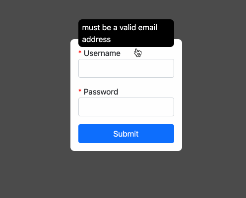

# Login Form Exercise

## The Goal


## Instructions

* Fork this repository and do all of your work in the ```src``` folder.
* Create a form with an email input, a password input, and a submit button.
* Create tooltips for each of the inputs.
* Require all inputs and alert the user to the requirement.
* Use bootstrap classes to style the login form.


## Resources

    Normalize.css
        https://cdnjs.com/libraries/normalize
        select this option:
            https://cdnjs.cloudflare.com/ajax/libs/normalize/8.0.1/normalize.min.css
    Bootstrap
        https://cdnjs.com/libraries/bootstrap
        select this option:
            https://cdnjs.cloudflare.com/ajax/libs/bootstrap/5.0.2/css/bootstrap.min.css


